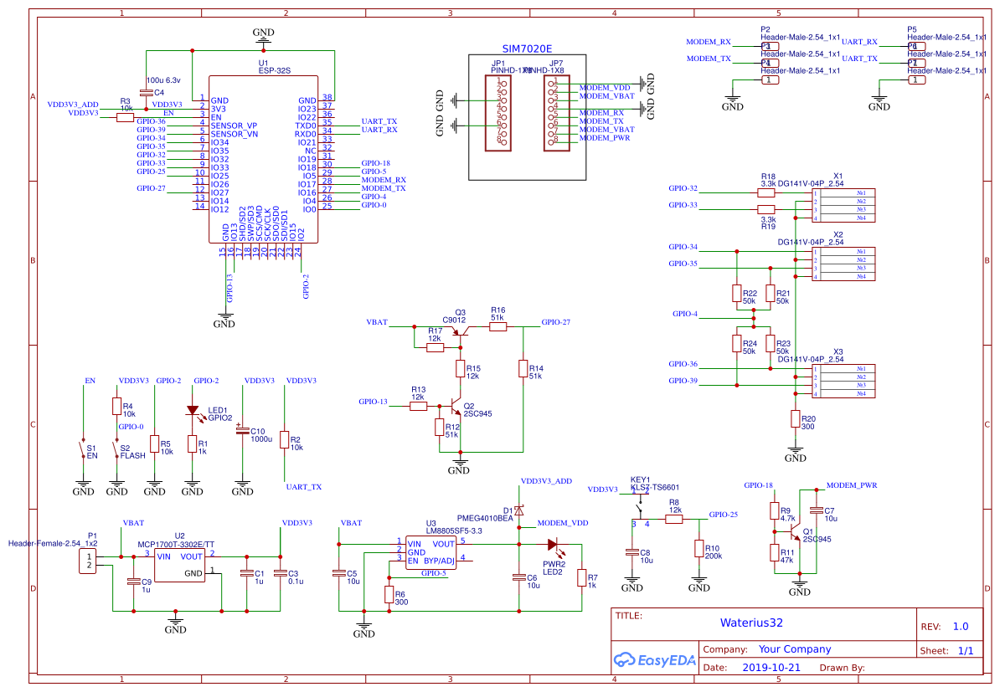

```
__        ___  _____ _____ ____  ___ _   _ ____       _________  
\ \      / / \|_   _| ____|  _ \|_ _| | | / ___|     |___ /___ \ 
 \ \ /\ / / _ \ | | |  _| | |_) || || | | \___ \ _____ |_ \ __) |
  \ V  V / ___ \| | | |___|  _ < | || |_| |___) |_____|__) / __/ 
   \_/\_/_/   \_\_| |_____|_| \_\___|\___/|____/     |____/_____|
   
```
# Познавательно-исследовательский проект

### Цель экспиремента
Перенести логику и наработанные механизмы проекта [Waterius](https://github.com/dontsovcmc/waterius) на моно кристал ESP32.
Основные постулаты:
- Во главе угла проекта долгосрочная автономная работа от элементов питания
- Простота сборки, настройки и управления
- Большое кол-во IO портов для подключения сенсоров
- Управление NB-IOT модемом

### Архитектура
- Используемые GPIO:
```
  GPIO-25 - Setup button

  GPIO-32 - analog counter_0 (Namur), using internal PullUp
  GPIO-33 - analog counter_1 (Namur), using internal PullUp

  GPIO-02 - BUILD IN LED
  GPIO-05 - HIGH level activate additional power supply for WiFi/BT purpose
  GPIO-27 - Measuring Input voltage, after LDO

  GPIO-04 - the sourse of reference voltage for sensors
  GPIO-34 - Water Sensor 0
  GPIO-35 - Water Sensor 1
  GPIO-36 - Water Sensor 2
  GPIO-39 - Water Sensor 3
  
  GPIO-16 - RX NB-IOT
  GPIO-17 - TX NB-IOT
  GPIO-18 - EN NB-IOT
```
- [Кнопка управления](BUTTON.md)
- 


### Проблемы
- Как оказалось, при детальном погружении в тему, не понятно чем питать ESP32. Рекомендации разработчиков 3.3в минимум 500мА источник. Широко распространенные LDO способные отдать такой ток имеют высокое потребление по сравнению с потреблением всей схемы в режиме покоя. В интернетах народ не парится, а использует прямое подключение к элементам питания LiFePo4, так себе решение.
- Сопроцессор ULP на котором реализована логика опроса датчиков программируется на ассемблере, очень сильно урезанном ассемблере.
- Как отлаживать асемблерный код ULP?
- Кто-нибудь знает как получить из ULP текущее значение регистра PC?!
- В рамках проекта на ULP возложены функции считывания данных с ADC, усреднение значений, инкрементация значений счетчиков, обработка данных с digital датчиков, обработка кнопки управления, пробуждение CPU в случае необходимости. Все эти задачи порождают не малую простынку ассемблерного кода и в конце концов получаем ошибку - 

```
ulp_process_macros_and_load(): program too big: 133 words, max is 128 words
  ERROR     (ULP) : Error loading ULP code!
```

VSCode и Platformio с ардуино фреймворком используют прекомпелированные файлы собраны с параметром CONFIG_ULP_COPROC_RESERVE_MEM 512. Решение с простор интернета [Increase ULP program size](https://www.esp32.com/viewtopic.php?t=7023)

- В момент пробуждения CPU из глубокого сна ULP получает от АЦП некорректные значения [ESP32 ULP ADC sampling glitch during wakeup](https://esp32.com/viewtopic.php?t=7105). Что с этим делать не совсем ясно.

```
ID: 1505         Value: 171
ID: 1506         Value: 171
ID: 1507         Value: 172
ID: 1508         Value: 170
ID: 1509         Value: 172
ID: 1510         Value: 170
ID: 1511         Value: 171
ID: 1512         Value: 4095 <- Bug, while wakeup CPU
ID: 1513         Value: 170
ID: 1514         Value: 169
ID: 1515         Value: 171
ID: 1516         Value: 170
ID: 1517         Value: 170
ID: 1518         Value: 169
ID: 1519         Value: 169
ID: 1520         Value: 168
```

- На борту ESP два ADC (18 pins maximum), но если в проекте испльзуется WiFi, то доступен к использованию только ADC-1. Но 4 его канала не имею встроенной подтяжки, а 2 заняты конденсаторами [analogRead not working on pins 37,38](https://github.com/espressif/arduino-esp32/issues/397). Из 18 остается **ВСЕГО** два ADC канала для наших нужд.
```
//     ADC1_CHANNEL_0 = 0, /*!< ADC1 channel 0 is GPIO36 */ - без internal PullUp/PullDown
//     ADC1_CHANNEL_1,     /*!< ADC1 channel 1 is GPIO37 */ - SENSOR_CAPP
//     ADC1_CHANNEL_2,     /*!< ADC1 channel 2 is GPIO38 */ - SENSOR_CAPN
//     ADC1_CHANNEL_3,     /*!< ADC1 channel 3 is GPIO39 */ - без internal PullUp/PullDown
//     ADC1_CHANNEL_4,     /*!< ADC1 channel 4 is GPIO32 */
//     ADC1_CHANNEL_5,     /*!< ADC1 channel 5 is GPIO33 */
//     ADC1_CHANNEL_6,     /*!< ADC1 channel 6 is GPIO34 */ - без internal PullUp/PullDown
//     ADC1_CHANNEL_7,     /*!< ADC1 channel 7 is GPIO35 */ - без internal PullUp/PullDown
```

### Результат

#### Потребление в различных режимах (with Debug output):
- 20-30 мкА ESP32 в режиме DeepSleep, с запущенным ULP, ведется подсчет импульсов
- 53 мА     ESP32 в нормальный режиме работы, ULP ведет подсчет импульсов, WiFi/BT выключены
- 130 мА    ESP32 в нормальном режиме работы, ULP ведет подсчет импульсов, WiFi подключен и передаются данные, BT выключен
- 80-130 мА ESP32 в нормальном режиме работы, ULP ведет подсчет импульсов, WiFi/BT выключены, NB-IoT модем активирован, регистрация в LTE сети и передача данных

### Вывод
Предварительно, в связи с все новыми и новыми открывающимися проблемами и ограничениями платформы ESP32, легаси проект Waterius -  **дешевле, проще, автономнее**. Реализация на ESP32 не целесообразна.
